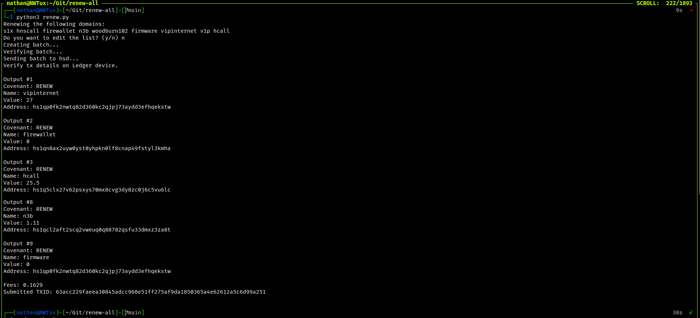

# Renew All Domains in Bob or HSD

Make sure you have these installed:
- Node.js and npm (https://nodejs.org/en/download/)
- Git (https://git-scm.com/downloads)
- Python3


Clone this repository:
```bash
git clone https://git.woodburn.au/nathanwoodburn/renew-all.git
cd renew-all
```
Install hsd-ledger package in the repository:

```bash
git clone https://github.com/Nathanwoodburn/hsd-ledger.git
cd hsd-ledger
npm install
```

Make sure HSD or Bob is running.
Copy .env.example to .env and fill in the details.

Run the script:
```bash
python3 -m pip install -r requirements.txt
python3 renew.py
```

## ENV Variables
HSD and wallet variables are required.
```bash
API_KEY=hsd-api-key
ACCOUNT=wallet-name
PASSWORD=wallet-password
```

### Renewal types
There are 2 types of renewals, expiring and all.

#### Expiring
This will renew all domains that are expiring within the next X days.
```bash
RENEW_TYPE=expiring
RENEW_DAYS=365
```

#### All
This will renew all domains in the wallet.
```bash
RENEW_TYPE=all
```

## Screenshots
